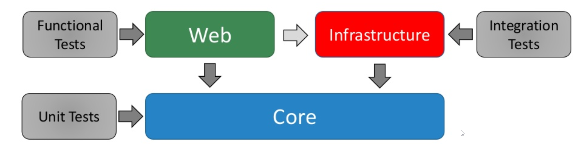
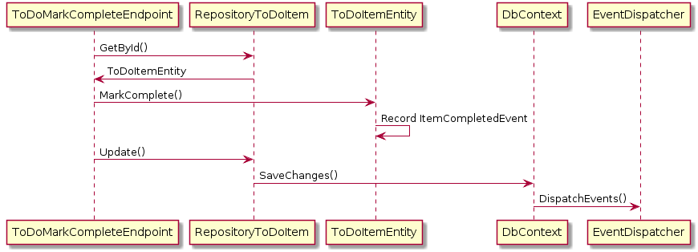

# Wrak.Clean.Blazor

A template for spinning up new Blazor Server / Clean Architecture solutions: CQRS via MediatR, FluentValidation, and a Blazor Server UI (MudBlazor), wired together
with dependency injection. This repo has no business domain of its own — it exists to be
generated (via `dotnet new`, below) into a fresh, client-specific solution, already carrying this
codebase's conventions and its AI-agent guidance.

Looking for a React frontend instead of Blazor Server? See the sibling template,
[wrak.clean.react](https://github.com/wrakocy/wrak.clean.react) — same `Core`/`Infrastructure`
backend conventions, an ASP.NET Core Web API + React SPA in place of Blazor. The two are fully
independent repos; nothing is shared between them.

## Quickstart: generate a new client solution

Prerequisites: .NET 10 SDK, a clone of this repo.

```bash
dotnet new install .
dotnet new blazor-clean -n <Company>.<Product> -o <path-to-new-solution>
```

If the template is already installed and you just want the latest version of it, `git pull` in
this clone — installing by local path is a live reference, not a snapshot, so the next
`dotnet new blazor-clean` picks up whatever's currently checked out here with no reinstall step.

Full mechanics — exactly what gets renamed vs. what still needs manual editing, updating,
uninstalling, and troubleshooting — live in
[docs/00-using-as-a-template.md](docs/00-using-as-a-template.md). Don't guess at any of that from
this section; that doc is the source of truth and is kept current with how `dotnet new` actually
behaves against this template.

## What a generated solution includes

- Working `Core`/`Infrastructure`/`Web`/test projects, already renamed to `<Company>.<Product>.*`
  and buildable out of the box (`dotnet build`/`dotnet test`).
- Full AI-agent guidance, carried over and renamed with everything else: [AGENTS.md](AGENTS.md),
  [CLAUDE.md](CLAUDE.md), [.github/copilot-instructions.md](.github/copilot-instructions.md),
  [.claude/skills/](.claude/skills/), and [.github/instructions/](.github/instructions/). Claude
  Code or GitHub Copilot working in the new repo already knows this codebase's CQRS/DI/testing
  conventions from the first commit — nothing to re-teach it per client.
- A few things generation deliberately does **not** decide for you: the persistence-model
  checkbox and one-line domain description in `AGENTS.md`/`copilot-instructions.md` (still
  placeholders, called out by the HTML comments already sitting in both files), and this README
  itself, which is written from the template's point of view and should be replaced with
  something describing the client's actual product.

## Architecture at a glance

```
Web  →  Infrastructure  →  Core
(Core references nothing else in the solution)
```

| Project | Purpose |
| --- | --- |
| `Core` | CQRS use cases (Commands/Queries/Handlers via MediatR), domain events, models, validators, and the interfaces for everything outside Core. No ASP.NET, no EF Core, no UI. |
| `Infrastructure` | Implements Core's interfaces — repositories (EF Core) and/or external API clients, `AppBus` (the only class allowed to touch `IMediator` directly), cross-cutting filters. |
| `Web` | The ASP.NET Core host and Blazor Server UI (MudBlazor + Heron MudCalendar). All DI wiring lives in one `DependencyInjectionExtensions.cs`, called in order from `Program.cs`. |
| `UnitTests` / `IntegrationTests` / `FunctionalTests` | See [docs/04-testing-guide.md](docs/04-testing-guide.md) for what belongs in each. |

Full write-up, including the two persistence shapes this template supports (external API client,
EF Core database, or both) and the request-flow diagram: [docs/01-architecture-overview.md](docs/01-architecture-overview.md).



### Two patterns worth knowing before you build a feature

- **Domain events** decouple a trigger from its handler(s) — useful since a domain entity
  publishing an event typically has no dependencies, while the handler reacting to it can. See
  [docs/03-feature-development-guide.md](docs/03-feature-development-guide.md) §4 for the
  generic shape, or the diagram below for how it flows through a request end-to-end.

  

- **Guard clauses**, via the [Throw](https://github.com/amantinband/throw) package
  (`x.ThrowIfNull().Value`), fail fast on invalid input at constructors and the top of every
  handler's `Handle` method — never a hand-rolled `if (x == null) throw ...`.

## Building out a new feature

Once you've generated a client solution (or are extending this template itself), see
[docs/03-feature-development-guide.md](docs/03-feature-development-guide.md) for the canonical
shape of a new CQRS feature, domain event, validator, persistence integration, and Blazor page —
or just ask your agent to add one; it already knows these conventions via
[.claude/skills/](.claude/skills/) / [.github/instructions/](.github/instructions/).

Before opening a PR, see AGENTS.md's [PR Workflow](AGENTS.md#pr-workflow) (Claude Code) or
copilot-instructions.md's [Development & Review Workflow](.github/copilot-instructions.md) —
one primary implementation pass plus deterministic verification, with the `code-reviewer`,
`test-reviewer`, `ui-reviewer`, and `security-reviewer` agents invoked only at the risk boundaries
each one actually applies to. The Claude Code procedure is spelled out in
[.claude/skills/verify-and-review/](.claude/skills/verify-and-review/).

## Working on this template itself

Not generating a client solution — extending the template's own defaults (a new base class, a
new skill, a new baseline package)? See [docs/02-bootstrap-guide.md](docs/02-bootstrap-guide.md)
for how the scaffold is built.

Launch it directly via Visual Studio — open the `.slnx` and hit F5/F6; `Web` is already set as the
default startup project (`DefaultStartup="true"` in the `.slnx`) and every launch profile in its
`launchSettings.json` runs with `ASPNETCORE_ENVIRONMENT=Development`, so no manual setup is
needed. Or from the CLI:

```bash
dotnet build Wrak.Clean.Blazor.slnx
dotnet test Wrak.Clean.Blazor.slnx
```

## Further reading

This template's design goal is a well-factored, highly-testable, SOLID foundation. If any of
Clean Architecture, SOLID, or CQRS/domain events are new to you:

- [SOLID Principles for C# Developers](https://www.pluralsight.com/courses/csharp-solid-principles)
- [SOLID Principles of Object Oriented Design](https://www.pluralsight.com/courses/principles-oo-design) (the original, longer course)
- [Clean Architecture: Patterns, Practices, and Principles](https://www.pluralsight.com/courses/clean-architecture-patterns-practices-principles)

Coming from a single-project or "N-Tier" (UI → Business Layer → Data Access Layer) background,
these two are worth watching before the Clean Architecture course above:

- [Creating N-Tier Applications in C#, Part 1](https://www.pluralsight.com/courses/n-tier-apps-part1)
- [Creating N-Tier Applications in C#, Part 2](https://www.pluralsight.com/courses/n-tier-csharp-part2)
