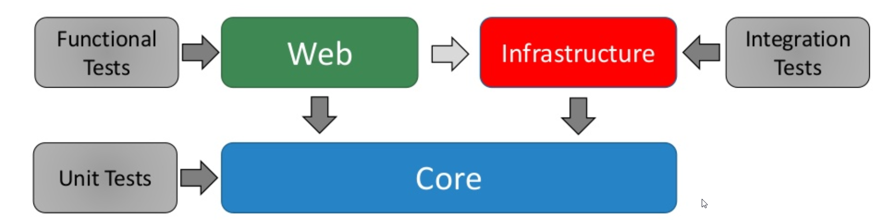
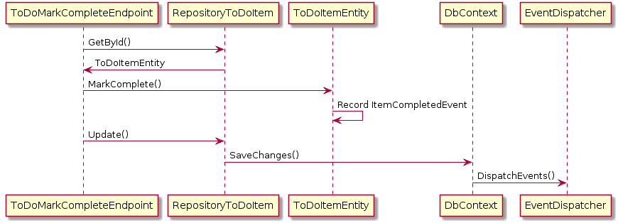

# Wrak.CleanBlazor

A template for spinning up new Blazor Server / Clean Architecture solutions: CQRS via MediatR, FluentValidation, and a Blazor Server UI (MudBlazor), wired together
with dependency injection. This repo has no business domain of its own — it exists to be
generated (via `dotnet new`, below) into a fresh, client-specific solution, already carrying this
codebase's conventions and its AI-agent guidance.

## Quickstart: generate a new client solution

Prerequisites: .NET 10 SDK, a clone of this repo.

```bash
dotnet new install .
dotnet new blazor-clean -n <Company>.<Product> -o <path-to-new-solution>
```

If the template is already installed and you just want the latest version of it, `git pull` in
this clone — installing by local path is a live reference, not a snapshot, so the next
`dotnet new blazor-clean` picks up whatever's currently checked out here with no reinstall step.

Full mechanics — exactly what gets renamed vs. what still needs manual editing, updating,
uninstalling, and troubleshooting — live in
[docs/00-using-as-a-template.md](docs/00-using-as-a-template.md). Don't guess at any of that from
this section; that doc is the source of truth and is kept current with how `dotnet new` actually
behaves against this template.

## What a generated solution includes

- Working `Core`/`Infrastructure`/`Web`/test projects, already renamed to `<Company>.<Product>.*`
  and buildable out of the box (`dotnet build`/`dotnet test`).
- Full AI-agent guidance, carried over and renamed with everything else: [AGENTS.md](AGENTS.md),
  [CLAUDE.md](CLAUDE.md), [.github/copilot-instructions.md](.github/copilot-instructions.md),
  [.claude/skills/](.claude/skills/), and [.github/instructions/](.github/instructions/). Claude
  Code or GitHub Copilot working in the new repo already knows this codebase's CQRS/DI/testing
  conventions from the first commit — nothing to re-teach it per client.
- A few things generation deliberately does **not** decide for you: the persistence-model
  checkbox and one-line domain description in `AGENTS.md`/`copilot-instructions.md` (still
  placeholders, called out by the HTML comments already sitting in both files), and this README
  itself, which is written from the template's point of view and should be replaced with
  something describing the client's actual product.

## Architecture at a glance

```
Web  →  Infrastructure  →  Core
(Core references nothing else in the solution)
```

| Project | Purpose |
| --- | --- |
| `Core` | CQRS use cases (Commands/Queries/Handlers via MediatR), domain events, models, validators, and the interfaces for everything outside Core. No ASP.NET, no EF Core, no UI. |
| `Infrastructure` | Implements Core's interfaces — repositories (EF Core) and/or external API clients, `AppBus` (the only class allowed to touch `IMediator` directly), cross-cutting filters. |
| `Web` | The ASP.NET Core host and Blazor Server UI (MudBlazor + Heron MudCalendar). All DI wiring lives in one `DependencyInjectionExtensions.cs`, called in order from `Program.cs`. |
| `UnitTests` / `IntegrationTests` / `FunctionalTests` | See [docs/04-testing-guide.md](docs/04-testing-guide.md) for what belongs in each. |

Full write-up, including the two persistence shapes this template supports (external API client,
EF Core database, or both) and the request-flow diagram: [docs/01-architecture-overview.md](docs/01-architecture-overview.md).



### Two patterns worth knowing before you build a feature

- **Domain events** decouple a trigger from its handler(s) — useful since a domain entity
  publishing an event typically has no dependencies, while the handler reacting to it can. See
  [docs/03-feature-development-guide.md](docs/03-feature-development-guide.md) §4 for the
  generic shape, or the diagram below for how it flows through a request end-to-end.

  

- **Guard clauses**, via the [Throw](https://github.com/amantinband/throw) package
  (`x.ThrowIfNull().Value`), fail fast on invalid input at constructors and the top of every
  handler's `Handle` method — never a hand-rolled `if (x == null) throw ...`.

## Building out a new feature

Once you've generated a client solution (or are extending this template itself), see
[docs/03-feature-development-guide.md](docs/03-feature-development-guide.md) for the canonical
shape of a new CQRS feature, domain event, validator, persistence integration, and Blazor page —
or just ask your agent to add one; it already knows these conventions via
[.claude/skills/](.claude/skills/) / [.github/instructions/](.github/instructions/).

Before opening a PR, see AGENTS.md's [PR Workflow](AGENTS.md#pr-workflow) (Claude Code) or
copilot-instructions.md's [Development & Review Workflow](.github/copilot-instructions.md) —
one primary implementation pass plus deterministic verification, with the `code-reviewer`,
`test-reviewer`, and `security-reviewer` agents invoked only at the risk boundaries each one
actually applies to (UI review is a conditional section inside `code-reviewer`, not a separate
agent). The Claude Code procedure is spelled out in
[.claude/skills/verify-and-review/](.claude/skills/verify-and-review/).

## Working on this template itself

Not generating a client solution — extending the template's own defaults (a new base class, a
new skill, a new baseline package)? See [docs/02-bootstrap-guide.md](docs/02-bootstrap-guide.md)
for how the scaffold is built.

Launch it directly via Visual Studio — open the `.slnx` and hit F5/F6; `Web` is already set as the
default startup project (`DefaultStartup="true"` in the `.slnx`) and every launch profile in its
`launchSettings.json` runs with `ASPNETCORE_ENVIRONMENT=Development`, so no manual setup is
needed. Or from the CLI:

```bash
dotnet build Wrak.CleanBlazor.slnx
dotnet test Wrak.CleanBlazor.slnx
```

## Branching, CI and Deployment

The repository has a single long-lived branch, `main`. Work happens on short-lived feature
branches merged into `main` through pull requests. Builds and deployments run in GitHub Actions,
using two workflows that do separate jobs:

| Workflow | File | Runs when | What it does |
| --- | --- | --- | --- |
| **ci** | `.github/workflows/ci.yml` | Every push to `main` and every pull request targeting `main` (or manually) | Builds and verifies the code, and publishes a deployable package |
| **deploy** | `.github/workflows/deploy.yml` | Automatically after every CI run of `main` (Test only), or when someone runs it manually | Deploys a package produced by CI to Test or Production |

### CI

CI runs the same checks you should run locally before opening a pull request, in this order:

1. Stamps the run number into `BuildInfo.cs` (shown in the app's About page).
2. Restores NuGet packages.
3. Verifies pinned package versions (`Verify-Package-Versions.ps1`).
4. Verifies formatting (`dotnet format --verify-no-changes`).
5. Builds the solution (Release).
6. Runs all unit, integration and functional tests.

On a push to `main` (not on a pull request), if **every** step passes, CI then publishes the Web
project and uploads it as an artifact named `drop`. A run with any failure produces no artifact,
so there is nothing to deploy. The package contains no environment-specific settings or secrets;
the same package is deployed to Test and then promoted, unchanged, to Production.

#### Running CI manually

You rarely need to — CI runs for every pull request and push to `main`. If a run failed for a
reason unrelated to your change (a flaky test, a runner problem), use **Re-run failed jobs** on
the run. To start one anyway, use **Actions → ci → Run workflow** and pick the branch. A manual
run never publishes `drop`.

### Deploying

Deployment is **off by default**: both `deploy` jobs are skipped unless the repository variable
`DEPLOY_ENABLED` is `true`, so this template and freshly generated projects stay inert. See
[docs/00-using-as-a-template.md](docs/00-using-as-a-template.md#turning-on-deployments) for the
one-time setup.

**Test deploys automatically.** Whenever a CI run of `main` completes, `deploy` starts and
deploys that run's package to Test. **Production is always manual**, and you can also deploy to
Test manually (for example, to redeploy an older build). Use **Actions → deploy → Run workflow**
(from `main`):

1. Choose the **environment**: `Test` or `Production`.
2. Optionally enter a **CI run id**. Blank means the latest successful CI push run of `main`. To
   promote a build from Test to Production, enter the same run id you deployed to Test.
3. Run it. The workflow has two jobs:
   - **validate** confirms the CI run succeeded, was a push to `main`, is a `ci.yml` run, and
     still has its `drop` artifact; and that an automatic run is targeting Test. If not, the
     deployment stops here — before any approval is requested.
   - **deploy** waits for approval from the GitHub Environment's required reviewers (configure
     them on Production), reads the environment's secrets from Azure Key Vault, applies them as
     App Service app settings, and deploys the package.

The build number on the About page is the CI run's number (the `#N` in the Actions run list). The
**CI run id** the deploy workflow asks for is the different number at the end of that run's URL
(`.../actions/runs/<id>`).

CI runs of `main` that failed, or that weren't pushes, don't start a deployment (the `deploy`
run is skipped). The workflow also sets `ASPNETCORE_ENVIRONMENT` on the App Service to the target
environment name, which selects `appsettings.Test.json` / `appsettings.Production.json`.

### Configuration and Secrets

No secrets are stored in the repository. `appsettings.Test.json` and `appsettings.Production.json`
only hold non-sensitive values. Everything else is supplied by the deploy workflow as **App
Service app settings**, which the app reads as environment variables that override the
`appsettings` files (for example `AzureAd__ClientSecret` supplies `AzureAd:ClientSecret`).

| App setting | Key Vault secret | Environments |
| --- | --- | --- |
| `AzureAd__TenantId` | `azure-ad-tenant-id` | Test, Production |
| `AzureAd__ClientId` | `azure-ad-client-id` | Test, Production |
| `AzureAd__ClientSecret` | `azure-ad-client-secret` | Test, Production |
| `ApplicationInsights__ConnectionString` | `app-insights-connection-string` (the full connection string) | Test, Production |

Per-environment values live in each **GitHub Environment** (Settings → Environments):

| Kind | Name | Purpose |
| --- | --- | --- |
| Variable | `KEY_VAULT_NAME` | Key Vault the secrets are read from |
| Variable | `WEBAPP_NAME` | App Service to deploy to |
| Variable | `RESOURCE_GROUP` | Resource group of that App Service |
| Secret | `AZURE_CLIENT_ID`, `AZURE_TENANT_ID`, `AZURE_SUBSCRIPTION_ID` | OIDC identity used by `azure/login` (no stored Azure password) |

To add a new secret or setting: create the secret in each environment's Key Vault, then add a
`"<secret-name>=<Section__Key>"` entry to the `mappings` list in `deploy.yml`. Deploying never
removes app settings; delete obsolete ones in the Azure portal.

### Branch protection

Recommended GitHub rulesets on `main`: require changes to go through a pull request, require the
`ci` check to pass (repository admins may bypass), and block deletion and force-pushes.

## Further reading

This template's design goal is a well-factored, highly-testable, SOLID foundation. If any of
Clean Architecture, SOLID, or CQRS/domain events are new to you:

- [SOLID Principles for C# Developers](https://www.pluralsight.com/courses/csharp-solid-principles)
- [SOLID Principles of Object Oriented Design](https://www.pluralsight.com/courses/principles-oo-design) (the original, longer course)
- [Clean Architecture: Patterns, Practices, and Principles](https://www.pluralsight.com/courses/clean-architecture-patterns-practices-principles)

Coming from a single-project or "N-Tier" (UI → Business Layer → Data Access Layer) background,
these two are worth watching before the Clean Architecture course above:

- [Creating N-Tier Applications in C#, Part 1](https://www.pluralsight.com/courses/n-tier-apps-part1)
- [Creating N-Tier Applications in C#, Part 2](https://www.pluralsight.com/courses/n-tier-csharp-part2)
